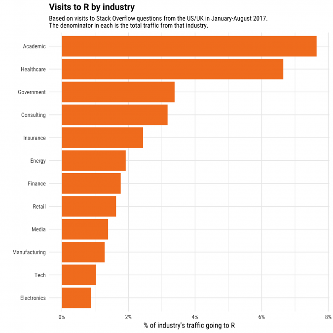
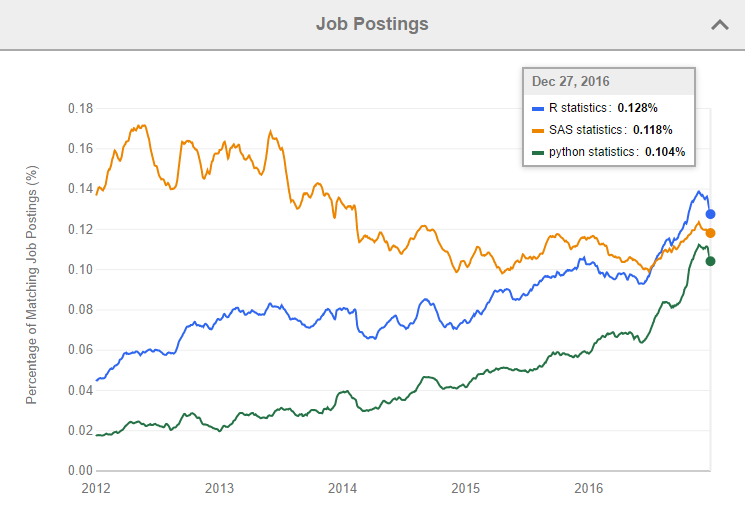
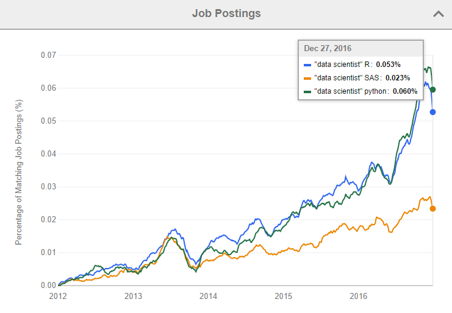

```{r setup, include=FALSE}
knitr::opts_chunk$set(
  echo = FALSE, out.width=".8\\linewidth", fig.width=6,
  fig.align = "center"
  )
```


## Today's Talk

1.  Social Mimicry
    
    *   Can we identify it?
    
    *   If there is any, how can we model it?
    
2.  Small network (statistics)

\pause

But first, a detour!

## Ranting about R vs SAS

We will look at the following myths:

1.  _"SAS is easier than R"_

2.  _"SAS is required for drug tests by the FDA"_

3.  _"R is cool... but it can't handle data out-of-memory like SAS"_

4.  _"SAS has a higher demand than R in the job market"_

## Ranting about R vs SAS

Myth: _"SAS is easier than R"_

Reallity: Take a look at this simple task of importing a CSV file with a header

\tiny

```r
dataset <- read.csv("mydata.csv")
```

```sas
PROC IMPORT DATAFILE = "mydata.csv" GETNAMES = yes OUT = dataset REPLACE;
  getmames = yes;
run;
```

\normalsize

You be the judge...


## Ranting about R vs SAS

Myth: _"SAS is required for drug tests by the FDA"_


---

{style="width:800px;"}

## Ranting about R vs SAS 

Myth: _"SAS is required for drug tests by the FDA"_

Reallity:

> FDA <span style="font-size:50px;font-weight:bold;">does not require use of any specific software for statistical analyses</span>, and statistical software
is not explicitly discussed in Title 21 of the Code of Federal Regulations [e.g., in 21CFR part
11]. However, the software package(s) used for statistical analyses should be fully documented
in the submission, including version and build identification.
--- [FDA, May 6, 2015](https://www.fda.gov/downloads/forindustry/datastandards/studydatastandards/ucm587506.pdf)


---

{style="width:75%"}


## Ranting about R vs SAS

Myth: _"R is cool... but it can't handle data out-of-memory like SAS"_

---

{style="width:75%;"}

## Ranting about R vs SAS

Myth: _"R is cool... but it can't handle data out-of-memory like SAS"_

Reallity: Just take a look at the [CRAN Task View for High Performance and Parallel Computing in R](https://cran.r-project.org/web/views/HighPerformanceComputing.html)

[biglm](https://cran.r-project.org/package=biglm),
[ff](https://cran.r-project.org/package=ff),
[bigmemory](https://cran.r-project.org/package=bigmemory),
[HadoopStreaming](https://cran.r-project.org/package=HadoopStreaming),
[speedglm](https://cran.r-project.org/package=speedglm),
[biglars](https://cran.r-project.org/package=biglars),
[MonetDB.R](https://cran.r-project.org/package=MonetDB.R),
[ffbase](https://cran.r-project.org/package=ffbase),
[LaF](https://cran.r-project.org/package=LaF),
[bigstatsr](https://cran.r-project.org/package=bigstatsr)

## Ranting about R vs SAS

Myth: _"SAS has a higher demand than R in the job market"_

---

{style="width:50%;"}

Source: [KDnuggets](https://www.kdnuggets.com/2018/05/poll-tools-analytics-data-science-machine-learning-results.html)

---

{style="width:50%;"}

Source: [Stackoverflow](https://stackoverflow.blog/2017/10/10/impressive-growth-r/)

---

As pointed out by [David Smith](https://ropensci.org/blog/2017/10/13/rprofile-david-smith/){target="_blank"} on ["Job trends for R and Python"](http://blog.revolutionanalytics.com/2017/02/job-trends-for-r-and-python.html){target="_blank"}

{class="img-std"}

Source: [indeed.com's Job trends](https://www.indeed.com/jobtrends/q-R-statistics-q-SAS-statistics-q-python-statistics.html){target="_blank"}

---

{class="img-std"}

Source: [indeed.com's Job trends](https://www.indeed.com/jobtrends/q-R-statistics-q-SAS-statistics-q-python-statistics.html){target="_blank"}

## Social Mimicry

-   Families were invited to a lab to eat together

-   Each family member was wearing a aaaa that tracked bites.

-   At the individual level, we recorded the moment at which she/he took a bite
    (fork/spoon to mouth).

---

```{r example-of-dyad, echo=FALSE, cache=FALSE, fig.align='center', fig.cap="Simulated dyad", fig.height=4, out.width = "600px"}
set.seed(21) 
plot(biteme::simulate_dyad(rates = c(.8, .5)), lwd=10)
```
    
So we have, $T_1 = \{t_1^1, t_1^2, t_1^3, t_1^4, t_1^5, t_1^6\}$, and
$T_2 = \{t_2^1, t_2^2, t_2^3\}$
    
    $$R(t_2^2, T_1) = t_1^3$$

---

Mathematically, we can describe the data as follows:

* For each individual $i$ we observe a vector $T_i \equiv\{t^i_1, t^i_2,\dots\}$ with $i$'s bites timestamps. You can think of this as a poisson process.

* Let $n_i$ denote the size of $T_i$.

* Also, define the function $R:T_i\times T_j\mapsto T_j$ as that which returns the **leftmost close** bite of $j$ to $i$, i.e. the inmediate bite of $j$ before $i$ took a particular bite:

$$
R(t_i^n, T_j) = \left\{\begin{array}{l}
\mbox{Undefined},\quad\mbox{if }(\forall t_j^n\in T_j) \exists t_i^m\in T_i \mbox{ s.th. }t_i^m\in(t_j^n,t_i^n) \\
\arg\max_{\{t_j^n:t_j^n\in T_j, t_j^n \leq t_i^n\}}t_i^n - t_j^n,\quad\mbox{otherwise.}
\end{array}\right.
$$
  
  For now we will focus on the cases where this is defined.

---

* A possible statistic is to take the average time gap between $i$ and $j$'s
  bite, formally, assuming $R(t, T_j)$ is defined for all $t\in T_i$, we have


$$
S_{ij} = \frac{1}{n_i}\sum_{t\in T_i}(t - R(t, T_j))
$$


## Permuting time intervals

*   Imagine we observe the followin: $T_{a} = \{0, 1, 3, 6\}$, then we have 
    $3! = 6$ total permutations as what is swapped are time intervals.
    
    ```{r example-permutations, echo=FALSE, fig.height=4, cache=TRUE, fig.cap="Distribution of permuted set (50,000 permutations)."}
    library(biteme)
    # Function to encode the shuffle
    shuffle_wrap <- function(dat) {
      paste0(shuffle_bites(dat)[,1], collapse="")
    }
    
    # Fake data. This has only 6 possible permutations
    dat <- cbind(
      time = c(0, 1, 3, 6),
      ids  = rep(1, 4)
    )
    
    # Tabulating and plotting the permutations
    n <- 5e4
    set.seed(111224)
    ans <- replicate(n, shuffle_wrap(dat))
    ans <- table(ans)/n
    
    # ans
    # ans
    #    0136    0146    0236    0256    0346    0356
    # 0.16842 0.16622 0.16618 0.16794 0.16566 0.16558
    
    # Plotting the distribution
    barplot(ans)
    ```
        


## Part 2: Small Network

* Observe small teams perfoming several tasks in a lab,

* Team members are surveyed before and after each task.

* From their responses, collective intelligence indicators were built.

* Also, they were asked about their perceptions of the social networks: leadership,
  advice, etc. Call this social cognition.
  
We are interested in the following question

----

*   How important is, if important at all, social cognition in group performance?

*   **Our problem**: Teams studied here (and everywhere) are usually very small, 
raging 4 to 5 members.

*   Our current approach: We defined an statistic that measures some sort of correlation:
    
    $$
    S_T\equiv 1-\frac{1}{n(n-1)}\sum_{\{(i, j):(i,j)\in T, i<j\}}H(i,j)
    $$
    
    Where $H(i,j)$ is the hamming distance between $i$ and $j$'s perceived social structures.

*   $S_T\in[0,1]$, where 1 means _perfect correlation_ (all subjects have the exact same perception of the graph.)
